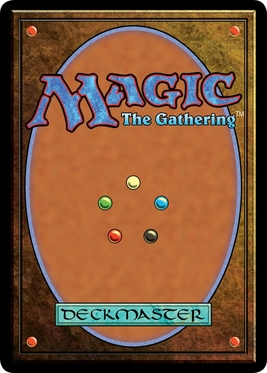
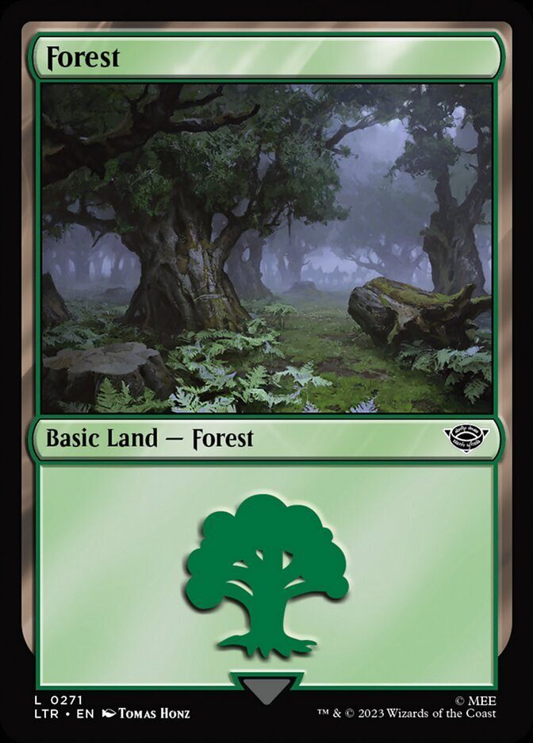

# Example Cards

I just included these as an example; they're AI slop, I was just curious how it'd fit the code with a Magic The Gathering style.

</img>
</img>
</img>
</img>

# Example Back

Just an example of how all cards have the same back (and it's clear it's the back), but different front (if you think back should be different, that's cool).
</img>
</img>